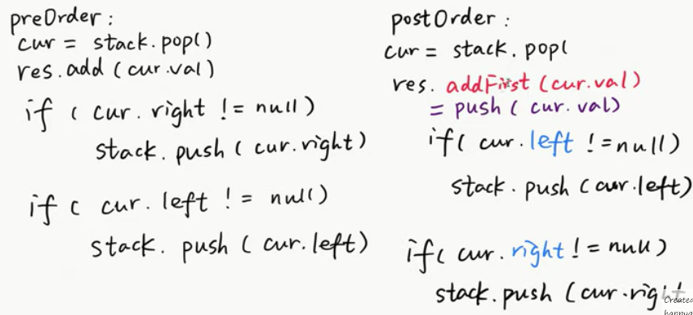

# Binary Tree

## Binary Tree Traversal

Preorder  
Inorder  
Postorder  

### 1. Recursion Template

<details>
  <summary>Python</summary>  

```python
def preorder_rec(root):
    if root is None:
        return
    visit(root)
    preorder_rec(root.left)
    preorder_rec(root.right)
    return

def inorder_rec(root):
    if root is None:
        return
    inorder_rec(root.left)
    visit(root)
    inorder_rec(root.right)
    return

def postorder_rec(root):
    if root is None:
        return
    postorder_rec(root.left)
    postorder_rec(root.right)
    visit(root)
    return
```  
</details>

### 2. Iterative

#### Preorder Traversal 
[Leetcode No144](https://leetcode.com/problems/binary-tree-preorder-traversal/)  

Using stack  

<details>
  <summary>Python</summary>

```Python
class Solution:
    def preorderTraversal(self, root: TreeNode) -> List[int]:
        preorder = []
        if root is None:
            return preorder
        
        s = [root]
        while len(s) > 0:
            node = s.pop()
            preorder.append(node.val)
            if node.right is not None:
                s.append(node.right)
            if node.left is not None:
                s.append(node.left)
        
        return preorder
```
</details>

#### Inorder Traversal
[Leetcode No94](https://leetcode.com/problems/binary-tree-inorder-traversal/)  

<details>
  <summary>Python</summary>

```Python
class Solution:
    def inorderTraversal(self, root: TreeNode) -> List[int]:
        s, inorder = [], []

        node = root
        while len(s) > 0 or node is not None:
            if node is not None:
                s.append(node)
                node = node.left
            else:
                node = s.pop()
                inorder.append(node.val)
                node = node.right
        return inorder
```
</details>

#### Postorder Traversal
[Leetcode No145](https://leetcode.com/problems/binary-tree-postorder-traversal/)  
 

<details>
  <summary>Python</summary>

```Python
class Solution:
    def postorderTraversal(self, root: TreeNode) -> List[int]:
        result=[]
        if root == None: 
            return result
        s=[root]
        
        while len(s) > 0:
            note = s.pop()
            # reverse: insert from the front
            result.insert(0, note.val)
            
            if note.left is not None:
                s.append(note.left)
            if note.right is not None:
                s.append(note.right)
        return result
```
</details>

DFS 深度搜索-从下向上（分治法）

```Python
class Solution:
    def preorderTraversal(self, root: TreeNode) -> List[int]:
        
        if root is None:
            return []
        
        left_result = self.preorderTraversal(root.left)
        right_result = self.preorderTraversal(root.right)
        
        return [root.val] + left_result + right_result
```

注意点：

> ???DFS 深度搜索（从上到下） 和分治法区别：前者一般将最终结果通过指针参数传入，后者一般递归返回结果最后合并

#### [BFS 层次遍历 No102](https://leetcode.com/problems/binary-tree-level-order-traversal/)

```Python
class Solution:
    def levelOrder(self, root: TreeNode) -> List[List[int]]:
        
        levels = []
        if root is None:
            return levels
        
        bfs = collections.deque([root])
        
        while len(bfs) > 0:
            levels.append([])
            
            level_size = len(bfs)
            for _ in range(level_size):
                node = bfs.popleft()
                levels[-1].append(node.val)
                
                if node.left is not None:
                    bfs.append(node.left)
                if node.right is not None:
                    bfs.append(node.right)
        
        return levels
```
Ref: https://www.youtube.com/watch?v=rm3KTnXSvus