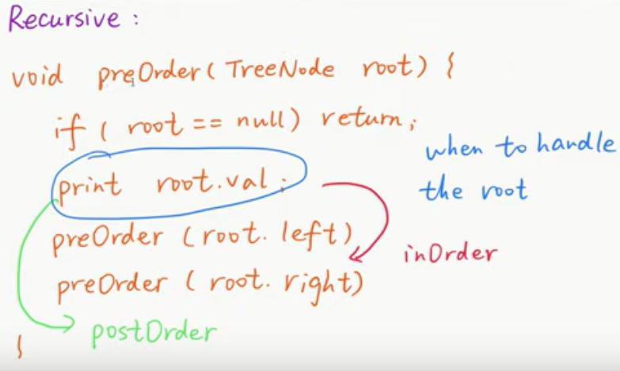

# Binary Tree
Ref: https://www.youtube.com/watch?v=rm3KTnXSvus

## **1. Binary Tree Traversal**

**Preorder--Inorder--Postorder**  

### **1.1 Recursion-DFS**

<details>
  <summary>Template</summary> 


 
```python
def preorder_rec(root):
    if root is None:
        return
    visit(root)
    preorder_rec(root.left)
    preorder_rec(root.right)
    return

def inorder_rec(root):
    if root is None:
        return
    inorder_rec(root.left)
    visit(root)
    inorder_rec(root.right)
    return

def postorder_rec(root):
    if root is None:
        return
    postorder_rec(root.left)
    postorder_rec(root.right)
    visit(root)
    return
```  
</details>


### **1.2 Iterative-DFS**

#### Preorder Traversal 
[Leetcode No144](https://leetcode.com/problems/binary-tree-preorder-traversal/)  
 <details>
  <summary>Solution</summary>


```Python
class Solution:
    def preorderTraversal(self, root: TreeNode) -> List[int]:
        preorder = []
        if root is None:
            return preorder
        
        s = [root]
        while len(s) > 0:
            node = s.pop()
            preorder.append(node.val)
            if node.right is not None:
                s.append(node.right)
            if node.left is not None:
                s.append(node.left)
        
        return preorder
```
</details>

#### Inorder Traversal
[Leetcode No94](https://leetcode.com/problems/binary-tree-inorder-traversal/)  

<details>
  <summary>Solution</summary>


```Python
class Solution:
    def inorderTraversal(self, root: TreeNode) -> List[int]:
        s, inorder = [], []

        node = root
        while len(s) > 0 or node is not None:
            if node is not None:
                s.append(node)
                node = node.left
            else:
                node = s.pop()
                inorder.append(node.val)
                node = node.right
        return inorder
```
</details>

#### Postorder Traversal
[Leetcode No145](https://leetcode.com/problems/binary-tree-postorder-traversal/)  
<details>
  <summary>Solution</summary>

 


```Python
class Solution:
    def postorderTraversal(self, root: TreeNode) -> List[int]:
        result=[]
        if root == None: 
            return result
        s=[root]
        
        while len(s) > 0:
            note = s.pop()
            # reverse: insert from the front
            result.insert(0, note.val)
            
            if note.left is not None:
                s.append(note.left)
            if note.right is not None:
                s.append(note.right)
        return result
```
</details>

<details>
  <summary>DFS(form up to bottom)-Traversal??</summary>
</details>

<details>
  <summary>DFS(form bottom to up)-Divide and Conquer</summary>

```Python
class Solution:
    def preorderTraversal(self, root: TreeNode) -> List[int]:
        
        if root is None:
            return []
        
        left_result = self.preorderTraversal(root.left)
        right_result = self.preorderTraversal(root.right)
        
        return [root.val] + left_result + right_result
```
</details>

## **2. BFS Level Order**
#### binary-tree-level-order-traversal
[Leetcode No102](https://leetcode.com/problems/binary-tree-level-order-traversal/)
<details>
  <summary>Solution</summary>

```Python
class Solution:
    def levelOrder(self, root: TreeNode) -> List[List[int]]:
        result = []
        if not root:
            return result
        # use queue to store each level
        q = []
        q.append(root)
        while len(q) != 0:
            tmp = []
            for i in range(len(q)):
                r = q.pop(0)
                if r.left:
                    q.append(r.left)
                if r.right:
                    q.append(r.right)
                tmp.append(r.val)
            result.append(tmp)
        return result
```
</details>

#### binary-tree-level-order-traversal-ii
[Leetcode No107](https://leetcode.com/problems/binary-tree-level-order-traversal-ii/)
<details>
  <summary>Solution</summary>

```python

```
</details>

#### binary-tree-zigzag-level-order-traversal 
[Leetcode No103](https://leetcode.com/problems/binary-tree-zigzag-level-order-traversal/)
<details>
  <summary>Solution-BFS</summary>

```Python
class Solution:
    def zigzagLevelOrder(self, root: TreeNode) -> List[List[int]]:
        result = []
        if not root:
            return result
        
        q = []
        q.append(root)
        level=0
        while len(q) != 0:
            tmp = []
            for i in range(len(q)):
                r = q.pop(0)
                if r.left:
                    q.append(r.left)
                if r.right:
                    q.append(r.right)
                tmp.append(r.val)
                
            # odd level, reverse nodes
            if level%2:
                tmp.reverse()
                
            level=level+1
            result.append(tmp)
        return result
```
</details>

<details>
  <summary>Solution-DFS</summary>
Deque  

```python
class Solution:
    def zigzagLevelOrder(self, root: TreeNode) -> List[List[int]]:
        def dfs(root, level):
            if not root:
                return root
            
            if level < len(result):
                # odd level, reverse
                if level % 2:
                    result[level].insert(0,root.val)
                else:
                    result[level].append(root.val)
            else:
                # In each level, add the first node
                result.append([root.val])
                
            if root.left:
                dfs(root.left, level +1)
            if root.right:
                dfs(root.right, level +1)
        result=[]
        dfs(root,0)
        return result
```
</details>

## **Summary**
- **Binary tree traversal-DFS(preorder, inorder, postorder):**   
 recursion, interative(using stack)
- **Binary tree traversal-BFS:** (using queue)


