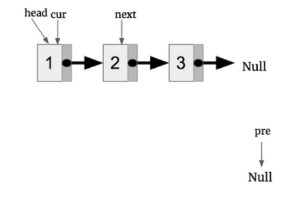
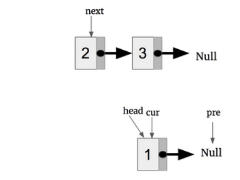
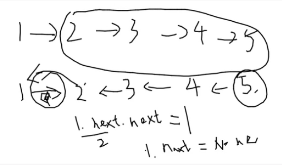

# Linked List

## **Porblems**
#### intersection-of-two-linked-lists
[Leetcode No160](https://leetcode.com/problems/intersection-of-two-linked-lists/)  

<details>
  <summary>Solution</summary>

- 1. The two links has already intersected. Get the length of two links, and move the longer one to the location so that the left of both has the same length. Then compare the nodes.
```python
class Solution:
    def getIntersectionNode(self, headA: ListNode, headB: ListNode) -> ListNode:
        if headA is None or headB is None:
            return None
        LA=headA
        LB=headB
        def getLength(head):
            c=0
            while head:
                c+=1
                head=head.next
            return c
        LengthA=getLength(LA)
        LengthB=getLength(LB)
        if LengthA>LengthB:
            temp=LengthA-LengthB
            while temp>0:
                LA=LA.next
                temp-=1
        if LengthA<LengthB:
            temp=LengthB-LengthA
            while temp>0:
                LB=LB.next
                temp-=1
        while LA and LB and LA != LB:
            LA=LA.next
            LB=LB.next
        
        if LA and LB:
            return LA
        else:
            return None
```
</details>

<details>
  <summary>Solution</summary>

- 2. Two pointer, traversal two links in turn. Finally, they could stop at the interaction. Or stop at None node.  
```python
class Solution:
    def getIntersectionNode(self, headA: ListNode, headB: ListNode) -> ListNode:
        LA=headA
        LB=headB
        while LA!=LB:
            # exchange
            if LA==None:
                LA=headB
            else:    
                LA=LA.next

            if LB==None:
                LB=headA
            else:
                LB=LB.next
        return LA
```

</details>

#### reverse-linked-list
[Leetcode No206](https://leetcode.com/problems/reverse-linked-list/)  

<details>
  <summary>Solution-Interactive</summary>

- Before
  
- After  


```Python
class Solution:
    def reverseList(self, head: ListNode) -> ListNode:
        if head is None:
            return head
        preNode=None
        curNode=head
        while curNode is not None:
            # move nextNode at beginning of each loop
            nextNode=curNode.next
            curNode.next=preNode
            preNode=curNode
            curNode=nextNode
            
        return preNode
```
</details>

<details>
  <summary>Solution-Recursive</summary>
  


```Python
class Solution:
    def reverseList(self, head: ListNode) -> ListNode:
        
        if head is None or head.next is None:
            return head
        
        rev_next = self.reverseList(head.next)
        head.next.next = head
        head.next = None
        
        return rev_next
```
</details>

#### merge-two-sorted-lists
[Leetcode No21](https://leetcode.com/problems/merge-two-sorted-lists/)  

<details>
  <summary>Solution-Recursive</summary>

```python
class Solution:
    def mergeTwoLists(self, l1: ListNode, l2: ListNode) -> ListNode:
        if l1 is None:
            return l2
        if l2 is None:
            return l1
        if l1.val < l2.val:
            l1.next=self.mergeTwoLists(l1.next,l2)
            return l1
        else:
            l2.next=self.mergeTwoLists(l1,l2.next)
            return l2
```
</details>

<details>
  <summary>Solution-Interactive(dummy node)</summary>

```python
class Solution:
    def mergeTwoLists(self, l1: ListNode, l2: ListNode) -> ListNode:
        dummy=ListNode()
        cur=dummy
        while l1 is not None and l2 is not None:
            if l1.val<l2.val:
                cur.next=l1
                l1=l1.next
            else:
                cur.next=l2
                l2=l2.next
            cur=cur.next
        
        if l1 is None:
            cur.next=l2
        if l2 is None:
            cur.next=l1
        return dummy.next
```
</details>

#### remove-duplicates-from-sorted-list
[Leetcode No83](https://leetcode.com/problems/remove-duplicates-from-sorted-list/)  

<details>
  <summary>Solution</summary>

```Python
class Solution:
    def deleteDuplicates(self, head: ListNode) -> ListNode:
        if head is None: return head
        cur=head
        while cur.next!=None:
            if cur.val==cur.next.val:
                cur.next=cur.next.next
            else:
                cur=cur.next
        return head
```
</details>

#### remove-nth-node-from-end-of-list
[Leetcode No19](https://leetcode.com/problems/remove-nth-node-from-end-of-list/)  

<details>
  <summary>Solution</summary>

- Two pointers, s and f. Move f to length-n, then move s and f at the same time so that s could get the right location when f at the end.
```python
class Solution:
    def removeNthFromEnd(self, head: ListNode, n: int) -> ListNode:
        dummy=ListNode()
        dummy.next=head
        fast=dummy
        slow=dummy
        while n>0:
            fast=fast.next
            n-=1
        if fast==None: return dummy.next   
        while fast.next:
            fast=fast.next
            slow=slow.next
        # [1] : the link has only one node, and delete this node
        slow.next=slow.next.next
        return dummy.next
``` 
</details>

#### swap-nodes-in-pairs
[Leetcode No24](https://leetcode.com/problems/swap-nodes-in-pairs/)  

<details>
  <summary>Solution</summary>

```python 
class Solution:
    def swapPairs(self, head: ListNode) -> ListNode:
        #dummy-   1   -   2   -   3   - 4
        #pre  -   a   -   b   -   tail
        dummy = ListNode()
        dummy.next=head
        pre=dummy
        while pre.next!=None and pre.next.next!=None:
            a=pre.next
            b=pre.next.next
            tail=b.next
            a.next=tail
            b.next=a
            pre.next=b
            pre=a
        return dummy.next 
``` 
</details>

#### add-two-numbers-ii
[Leetcode No445](https://leetcode.com/problems/add-two-numbers-ii/)

<details>
  <summary>Solution</summary>

```python  
class Solution:
    def addTwoNumbers(self, l1: ListNode, l2: ListNode) -> ListNode:
        stack1 = []
        stack2 = []
        # push into stack
        while l1:
            stack1.append(l1.val)
            l1 = l1.next
        while l2:
            stack2.append(l2.val)
            l2 = l2.next
            
        # add
        answer = None
        carry = 0
        while stack1 and stack2:
            add = stack1.pop() + stack2.pop() + carry
            carry = add//10
            temp = ListNode(add % 10)
            temp.next = answer
            answer=temp
            
        #link the left
        s = stack1 if stack1 else stack2
        while s:
            add = s.pop() + carry
            carry = add//10
            temp = ListNode(add % 10)
            temp.next = answer
            answer=temp
            
        if carry:
            temp = ListNode(1)
            temp.next = answer
            answer=temp
            
        return answer
```
</details>

#### palindrome-linked-list
[Leetcode No234](https://leetcode.com/problems/palindrome-linked-list/)  

<details>
  <summary>Solution</summary>

```python
# after the first while
# 1      2      3      4      5
#              slow          fast
#                     cur
class Solution:
    def isPalindrome(self, head: ListNode) -> bool:

        
        if head is None or head.next is None:
            return True
        slow=fast=head

        # move slow and fast pointer
        # even number and odd number
        while fast.next and fast.next.next:
            slow=slow.next
            fast=fast.next.next
            
        # reverse the second part
        cur=slow.next
        pre=None
        while cur is not None:
            temp=cur.next
            cur.next=pre
            pre=cur
            cur=temp
            
        # if equal or not
        L1=head
        L2=pre
        while (L1!=None and L2!= None):
            if L1.val!=L2.val:
                return False
            L1=L1.next
            L2=L2.next
        return True  
```
</details>

#### split-linked-list-in-parts
[Leetcode No725](https://leetcode.com/problems/split-linked-list-in-parts/)  

<details>
  <summary>Solution</summary>

return the heads of all parts
```python
# k=2
#    1      2      3       4        5 
#result[0]        pre   result[1]
class Solution:
    def splitListToParts(self, root: ListNode, k: int) -> List[ListNode]:
        length=0
        head=root
        result=[]
        while head!=None:
            length+=1
            head=head.next
        num=length//k # numbers in each part
        r=length%k
        head=root
        pre=None
        for i in range(k):
            result.append(head)
            for j in range(num+(r>0)):
                pre=head
                head=head.next
            r-=1
            #cut
            if pre:
                pre.next=None
                
        return result
```
</details>

#### odd-even-linked-list
[Leetcode No328](https://leetcode.com/problems/odd-even-linked-list/)  

<details>
  <summary>Solution</summary>
  
```python
 class Solution:
    def oddEvenList(self, head: ListNode) -> ListNode:
            
        if head == None:
            return head
        
        odd_p = head
        even_p = head.next
        even_head = even_p
        
        while even_p != None and even_p.next != None:
            odd_p.next = even_p.next
            odd_p = odd_p.next
            even_p.next = odd_p.next
            even_p = odd_p.next
            
        odd_p.next = even_head
        
        return head
```
</details>

## Summary
- Dummy node: deal with the first node
