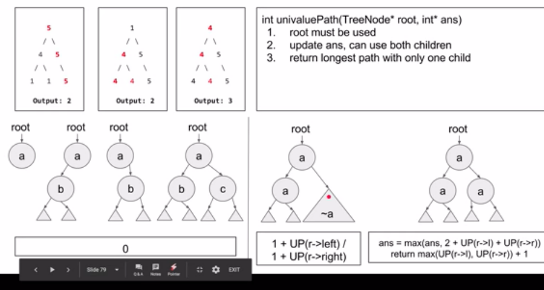
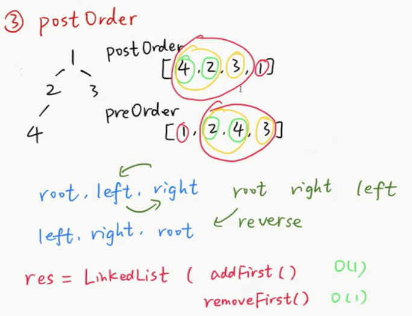

# Tree
## **Recursion**
#### maximum-depth-of-binary-tree 
[Leetcode No104](https://leetcode.com/problems/maximum-depth-of-binary-tree/)
<details>
  <summary>Solution</summary>

1. Divide Conquer
```Python
class Solution:
    def maxDepth(self, root: TreeNode) -> int:
        if root is None:
            return 0
        return 1 + max(self.maxDepth(root.left), self.maxDepth(root.right))
```
2. Level Order
```Python
class Solution:
    def maxDepth(self, root: TreeNode) -> int:
        result = 0
        if not root:
            return result
        # use queue
        q = []
        q.append(root)
        while len(q) != 0:
            result=result+1
            for i in range(len(q)):
                r = q.pop(0)
                if r.left:
                    q.append(r.left)
                if r.right:
                    q.append(r.right)

        return result
```
</details>

#### balanced-binary-tree 
[Leetcode No110](https://leetcode.com/problems/balanced-binary-tree/)
<details>
  <summary>Solution</summary>

a height-balanced binary tree:  
a binary tree in which the left and right subtrees of **every** node differ in height by no more than 1.

1. 分治法，左边平衡 && 右边平衡 && 左右两边高度 <= 1，

```Python
class Solution:
    result=True
    def isBalanced(self, root: TreeNode) -> bool:
    
        self.depth(root)
        return self.result
        
    def depth(self, root):
        
        if root is None:
            return 0

        depth_left=self.depth(root.left)
        depth_right=self.depth(root.right)
        
        if abs(depth_left-depth_right)>1:
            self.result=False
        
        return 1+max(depth_left,depth_right)
```

2. Interative-posorder??

```Python
class Solution:
    def isBalanced(self, root: TreeNode) -> bool:

        s = [[TreeNode(), -1, -1]]
        node, last = root, None
        while len(s) > 1 or node is not None:
            if node is not None:
                s.append([node, -1, -1])
                node = node.left
                if node is None:
                    s[-1][1] = 0
            else:
                peek = s[-1][0]
                if peek.right is not None and last != peek.right:
                    node = peek.right
                else:
                    if peek.right is None:
                        s[-1][2] = 0
                    last, dl, dr = s.pop()
                    if abs(dl - dr) > 1:
                        return False
                    d = max(dl, dr) + 1
                    if s[-1][1] == -1:
                        s[-1][1] = d
                    else:
                        s[-1][2] = d
        
        return True
```
</details>

#### diameter-of-binary-tree
[Leetcode No543](https://leetcode.com/problems/diameter-of-binary-tree/)
<details>
  <summary>Solution</summary>


```python
class Solution:
    result=0
    def diameterOfBinaryTree(self, root: TreeNode) -> int:
        if root is None:
            return 0
        
        def depth(root):
            if root is None:
                return 0
            left=depth(root.left)
            right=depth(root.right)
        
            # left+right is the longest path through the current node
            self.result=max(self.result, left+right)
        
            return 1+max(left,right)
        
        depth(root)
        
        return self.result
```
</details>

#### invert-binary-tree
[Leetcode No226](https://leetcode.com/problems/invert-binary-tree/)
<details>
  <summary>Solution</summary>

```python
class Solution:
    def invertTree(self, root: TreeNode) -> TreeNode:
        if root ==None:
            return root
        # exchange root.left and root.right
        left=TreeNode()
        left=root.left
        root.left=self.invertTree(root.right)
        root.right=self.invertTree(left)
        return root  
```
</details>

#### merge-two-binary-trees
[Leetcode No671](https://leetcode.com/problems/merge-two-binary-trees/)
<details>
  <summary>Solution</summary>

```python
class Solution:
    # t1, t2 is the same position of the two trees
    def mergeTrees(self, t1: TreeNode, t2: TreeNode) -> TreeNode:
        if t1==None and t2==None:
            return None
        if t1==None:
            return t2
        if t2==None:
            return t1
        value=t1.val+t2.val
        root = TreeNode(value)
        root.left=self.mergeTrees(t1.left,t2.left)
        root.right=self.mergeTrees(t1.right,t2.right)
        return root  
```
</details>

#### path-sum
[Leetcode No112](https://leetcode.com/problems/path-sum/)
<details>
  <summary>Solution</summary>

```python
class Solution:
    def hasPathSum(self, root: TreeNode, sum: int) -> bool:
        if root == None:
            return False
        if root.left == None and root.right == None and root.val == sum:
            return True
        return self.hasPathSum(root.left, sum - root.val) or self.hasPathSum(root.right, sum - root.val)
```  
</details>

#### path-sum-iii
[Leetcode No437](https://leetcode.com/problems/path-sum-iii/)
<details>
  <summary>Solution</summary>

```python
class Solution:
    result=0
    def pathSum(self, root: TreeNode, sum: int) -> int:
        
        def isEqual(root, sum):
            
            if root is None:
                return 
            if root.val==sum:
                self.result+=1
                 
            sum=sum-root.val
            isEqual(root.left, sum)
            isEqual(root.right,sum)
            return 
                
        if root is None:
            return 0
        
        isEqual(root, sum)
        self.pathSum(root.left, sum)
        self.pathSum(root.right,sum)
        return self.result
```
</details>

#### subtree-of-another-tree
[Leetcode No572](https://leetcode.com/problems/subtree-of-another-tree/)
<details>
  <summary>Solution</summary>

```python
class Solution:
    def isSubtree(self, s: TreeNode, t: TreeNode) -> bool:
        
        # find the right position to see if equal or not
        def isEqual(s,t):
            if s is None and t is None:
                return True
            if s is None or t is None:
                return False
            if s.val!=t.val:
                return False
            return isEqual(s.left,t.left) and isEqual(s.right, t.right)
            
        if s is None and t is None:
            return True
        if s is None or t is None:
            return False
        
        return isEqual(s,t) or self.isSubtree(s.left,t) or self.isSubtree(s.right,t)
```  
</details>

#### symmetric-tree
[Leetcode No101](https://leetcode.com/problems/symmetric-tree/)
<details>
  <summary>Solution</summary>

```python
class Solution:
    def isSymmetric(self, root: TreeNode) -> bool:
        if root is None:
            return True
        
        def symmetricTree(t1,t2):
            if t1 is None and t2 is None:
                return True
            if t1 is None or t2 is None:
                return False
            if t1.val!=t2.val:
                return False
            return symmetricTree(t1.left, t2.right) and symmetricTree(t1.right, t2.left)
        
        return symmetricTree(root.left,root.right)  
```
</details>

#### minimum-depth-of-binary-tree
[Leetcode No111](https://leetcode.com/problems/minimum-depth-of-binary-tree/)
<details>
  <summary>Solution</summary>

```python
class Solution:
    def minDepth(self, root: TreeNode) -> int:
        if root is None:
            return 0
        left = self.minDepth(root.left)
        right = self.minDepth(root.right)
        # the node with at least one None child
        # the path must be down to the leaf node
        if left == 0 or right == 0:
            return left + right + 1
        
        return min(left, right) + 1;  
```
</details>

#### sum-of-left-leaves
[Leetcode No404](https://leetcode.com/problems/sum-of-left-leaves/)
<details>
  <summary>Solution</summary>

 ```python
 class Solution:
    result=0
    def sumOfLeftLeaves(self, root: TreeNode) -> int:
        if root is None:
            return 0
        
        def SumLeavesLeft(root):
            if root.left is None and root.right is None:
                self.result+=root.val
                return
            elif root.left is None:
                SumLeavesRight(root.right)
            elif root.right is None:
                SumLeavesLeft(root.left)
            else:
                SumLeavesLeft(root.left)
                SumLeavesRight(root.right)
            
        def SumLeavesRight(root):
            if root.left is None and root.right is None:
                return
            elif root.left is None:
                SumLeavesRight(root.right)
            elif root.right is None:
                SumLeavesLeft(root.left)
            else:
                SumLeavesLeft(root.left)
                SumLeavesRight(root.right)
                
        if root.left is None and root.right is None:
            return 0
        elif root.left is None:
            SumLeavesRight(root.right)
        elif root.right is None:
            SumLeavesLeft(root.left)
        else:
            SumLeavesLeft(root.left)
            SumLeavesRight(root.right)
        
        return self.result
 ``` 
 ```python
 class Solution:
    def sumOfLeftLeaves(self, root: TreeNode) -> int:
        if root is None:
            return 0
        
        def isLeaf(root):
            if root is None:
                return False
            return root.left is None and root.right is None
        
        if isLeaf(root.left):
            return root.left.val + self.sumOfLeftLeaves(root.right)
        return self.sumOfLeftLeaves(root.left) + self.sumOfLeftLeaves(root.right)
 ```
</details>

#### longest-univalue-path
[Leetcode No687](https://leetcode.com/problems/longest-univalue-path/)
<details>
  <summary>Solution</summary>


```python
class Solution:
    result=0
    def longestUnivaluePath(self, root: TreeNode) -> int:
        if root is None:
            return 0
        
        def Path(root):
            if root is None:
                return 0
            left=Path(root.left)
            right=Path(root.right)
            
            # if the value is not equal, then 0
            left_temp=0
            right_temp=0

            #record one branch
            if root.left is not None and root.left.val==root.val:
                left_temp=left+1
            if root.right is not None and root.right.val==root.val:
                right_temp=right+1
            
            self.result= max(self.result, left_temp+right_temp)
            return max(left_temp,right_temp)
        
        Path(root)
        
        return self.result  
```  
</details>

#### house-robber-iii
[Leetcode No337](https://leetcode.com/problems/house-robber-iii/)
<details>
  <summary>Solution</summary>

```python
class Solution:
    def rob(self, root: TreeNode) -> int:
        
        def dfs(root):
            
            # it is not necessary to skip only one level
            if not root: return (0, 0)
            left=dfs(root.left)
            right=dfs(root.right)
            # rob this node, left[1] means not rob left child
            rob = root.val + left[1] + right[1]
            # not rob this node, then look at his children
            # maximum of left[0] and left[1]
            notrob = max(left) + max(right)            
            return (rob, notrob)
        
        return max(dfs(root))
```
</details>

#### second-minimum-node-in-a-binary-tree
[Leetcode No671](https://leetcode.com/problems/second-minimum-node-in-a-binary-tree/)
<details>
  <summary>Solution - DFS</summary>

```python
class Solution:
    def findSecondMinimumValue(self, root: TreeNode) -> int:
        if root is None:
            return -1
        if root.left is None and root.right is None:
            return -1
        
        leftValue = root.left.val
        rightValue = root.right.val
        
        # search the child having the same value with the current node 
        if leftValue == root.val:
            leftValue= self.findSecondMinimumValue(root.left)
        if rightValue == root.val:
            rightValue=self.findSecondMinimumValue(root.right)
        
        if leftValue != -1 and rightValue !=-1:
            return min(leftValue,rightValue)
        if leftValue !=-1:
            return leftValue
        else:
            return rightValue
```
</details>

<details>
  <summary>Solution - BFS</summary>

```python
```
</details>

## **Binary Tree Traversal**

**Preorder--Inorder--Postorder**  

### **Recursion-DFS**

<details>
  <summary>Template</summary> 


 
```python
def preorder_rec(root):
    if root is None:
        return
    visit(root)
    preorder_rec(root.left)
    preorder_rec(root.right)
    return

def inorder_rec(root):
    if root is None:
        return
    inorder_rec(root.left)
    visit(root)
    inorder_rec(root.right)
    return

def postorder_rec(root):
    if root is None:
        return
    postorder_rec(root.left)
    postorder_rec(root.right)
    visit(root)
    return
```  
</details>


### **Iterative-DFS**

#### Preorder Traversal 
[Leetcode No144](https://leetcode.com/problems/binary-tree-preorder-traversal/)  
 <details>
  <summary>Solution</summary>


```Python
class Solution:
    def preorderTraversal(self, root: TreeNode) -> List[int]:
        preorder = []
        if root is None:
            return preorder
        
        s = [root]
        while len(s) > 0:
            node = s.pop()
            preorder.append(node.val)
            if node.right is not None:
                s.append(node.right)
            if node.left is not None:
                s.append(node.left)
        
        return preorder
```
</details>

#### Inorder Traversal
[Leetcode No94](https://leetcode.com/problems/binary-tree-inorder-traversal/)  

<details>
  <summary>Solution</summary>


```Python
class Solution:
    def inorderTraversal(self, root: TreeNode) -> List[int]:
        s, inorder = [], []

        node = root
        while len(s) > 0 or node is not None:
            if node is not None:
                s.append(node)
                node = node.left
            else:
                node = s.pop()
                inorder.append(node.val)
                node = node.right
        return inorder
```
</details>

#### Postorder Traversal
[Leetcode No145](https://leetcode.com/problems/binary-tree-postorder-traversal/)  
<details>
  <summary>Solution</summary>

 


```Python
class Solution:
    def postorderTraversal(self, root: TreeNode) -> List[int]:
        result=[]
        if root == None: 
            return result
        s=[root]
        
        while len(s) > 0:
            note = s.pop()
            # reverse: insert from the front
            result.insert(0, note.val)
            
            if note.left is not None:
                s.append(note.left)
            if note.right is not None:
                s.append(note.right)
        return result
```
</details>

<details>
  <summary>DFS(form up to bottom)-Traversal??</summary>
</details>

<details>
  <summary>DFS(form bottom to up)-Divide and Conquer</summary>

```Python
class Solution:
    def preorderTraversal(self, root: TreeNode) -> List[int]:
        
        if root is None:
            return []
        
        left_result = self.preorderTraversal(root.left)
        right_result = self.preorderTraversal(root.right)
        
        return [root.val] + left_result + right_result
```
</details>

## **BFS-Level Order**

#### average-of-levels-in-binary-tree
[Leetcode No637](https://leetcode.com/problems/average-of-levels-in-binary-tree/)
<details>
  <summary>Solution</summary>
  
```python
class Solution:
    def averageOfLevels(self, root: TreeNode) -> List[float]:
        result = []
        if not root:
            return result
        # use queue to store each level
        q = []
        q.append(root)
        while len(q) != 0:
            num=len(q)
            level_v=0
            for i in range(num):
                r = q.pop(0)
                level_v+=r.val
                if r.left:
                    q.append(r.left)
                if r.right:
                    q.append(r.right)
            result.append(level_v/num)
                    
        return result
```
</details>

#### find-bottom-left-tree-value
[Leetcode No513](https://leetcode.com/problems/find-bottom-left-tree-value/)
<details>
  <summary>Solution</summary>

```python
class Solution:
    def findBottomLeftValue(self, root: TreeNode) -> int:
        if root is None:
            return root
        q=[]
        q.append(root)
        while len(q)!=0:
            node=q.pop(0)
            if node.right!= None:
                q.append(node.right)
            if node.left!=None:
                q.append(node.left)
        # return the last one of the queue        
        return node.val
```  
</details>

## **BST**
#### trim-a-binary-search-tree
[Leetcode No669](https://leetcode.com/problems/trim-a-binary-search-tree/)
<details>
  <summary>Solution</summary>

```python
class Solution:
    def trimBST(self, root: TreeNode, L: int, R: int) -> TreeNode:
        if root is None:
            return root
        if root.val > R:
            return self.trimBST(root.left, L, R)
        if root.val < L:
            return self.trimBST(root.right, L, R)
        
        # connect the left subtree to becoming the left child of root
        root.left = self.trimBST(root.left, L, R)
        # connect the right subtree to becoming the right child of root
        root.right = self.trimBST(root.right, L, R)
        
        return root
```  
</details>

#### kth-smallest-element-in-a-bst
[Leetcode No230](https://leetcode.com/problems/kth-smallest-element-in-a-bst/)
<details>
  <summary>Solution</summary>

```python
class Solution:
    count=0
    result=float('-inf')
    def kthSmallest(self, root: TreeNode, k: int) -> int:
        
        def inorder(root):
            if root is None:
                return
            inorder(root.left)
            self.count+=1
            if self.count==k:
                self.result=root.val
                return
            inorder(root.right)
        
        inorder(root)
        return self.result
```  
</details>

#### convert-bst-to-greater-tree
[Leetcode No538](https://leetcode.com/problems/convert-bst-to-greater-tree/)
<details>
  <summary>Solution</summary>

```python
class Solution:
    sumValue=0
    def convertBST(self, root: TreeNode) -> TreeNode:
        if root is None:
            return
        def greaterTree(root):
            if root is None:
                return
            greaterTree(root.right)
            self.sumValue+=root.val
            root.val=self.sumValue
            greaterTree(root.left)
            
        
        greaterTree(root)
        return root
```  
</details>

#### lowest-common-ancestor-of-a-binary-search-tree
[Leetcode No235](https://leetcode.com/problems/lowest-common-ancestor-of-a-binary-search-tree/)
<details>
  <summary>Solution</summary>

```python
class Solution:
    def lowestCommonAncestor(self, root: 'TreeNode', p: 'TreeNode', q: 'TreeNode') -> 'TreeNode':
        if root is None:
            return
        if root.val<p.val and root.val<q.val:
            return self.lowestCommonAncestor(root.right, p, q)
        if root.val>p.val and root.val>q.val:
            return self.lowestCommonAncestor(root.left, p, q)
        return root
```  
</details>

#### lowest-common-ancestor-of-a-binary-tree
[Leetcode No236](https://leetcode.com/problems/lowest-common-ancestor-of-a-binary-tree/)
<details>
  <summary>Solution</summary>

```python
class Solution:
    def lowestCommonAncestor(self, root: 'TreeNode', p: 'TreeNode', q: 'TreeNode') -> 'TreeNode':
        
        if root is None:
            return None
        
        if root == p or root == q:
            return root
        
        left=self.lowestCommonAncestor(root.left,p,q)
        right=self.lowestCommonAncestor(root.right,p,q)
        
        if left is not None and right is not None:
            return root
        elif left is not None:
            return left
        elif right is not None:
            return right
        else:
            return None
```  
</details>

#### convert-sorted-array-to-binary-search-tree
[Leetcode No108](https://leetcode.com/problems/convert-sorted-array-to-binary-search-tree/)
<details>
  <summary>Solution</summary>

```python
class Solution:
    def sortedArrayToBST(self, nums: List[int]) -> TreeNode:
        def createBST(nums, start, end):
            if start>end:
                return None
            mid=(start+end)//2
            root=TreeNode(nums[mid])
            root.left=createBST(nums, start, mid-1)
            root.right=createBST(nums, mid+1, end)
            
            return root 
        
        return createBST(nums,0,len(nums)-1)
```  
</details>

#### convert-sorted-list-to-binary-search-tree
[Leetcode No109](https://leetcode.com/problems/convert-sorted-list-to-binary-search-tree/)
<details>
  <summary>Solution</summary>

1. convert list to array, then the same as N108
2. use two pointers, slow and fast to find middle node
```python
class Solution:
    def sortedListToBST(self, head: ListNode) -> TreeNode:
        if head is None:
            return head
        # could not return head, because the head is a list node
        if head.next is None:
            return TreeNode(head.val)
        # mid, fast is two pointers, last is for cutting the list
        fast = head
        mid = head
        last = mid
        
        while fast.next and fast.next.next:
            last = mid
            mid = mid.next
            fast = fast.next.next
        
        fast = mid.next
        last.next = None
        
        node =TreeNode(mid.val)
        if mid != head:
            node.left = self.sortedListToBST(head)
        node.right = self.sortedListToBST(fast)
        
        return node
```
  
</details>

#### two-sum-iv-input-is-a-bst
[Leetcode No653](https://leetcode.com/problems/two-sum-iv-input-is-a-bst/)
<details>
  <summary>Solution</summary>

```python
class Solution:
    def findTarget(self, root: TreeNode, k: int) -> bool:
        
        result = set()
        def preOrder(root):
            if not root:
                return False
            
            if k - root.val in result:
                return True
            result.add(root.val)
            
            return preOrder(root.left) or preOrder(root.right)
        
        return preOrder(root)  
```
</details>

#### minimum-absolute-difference-in-bst
[Leetcode No530](https://leetcode.com/problems/minimum-absolute-difference-in-bst/)
<details>
  <summary>Solution</summary>

```python
# Inorder traversal, because it is ordered, compare two adjacent nodes
class Solution:
    prenode=None
    def getMinimumDifference(self, root: TreeNode) -> int:
        
        def inorder(root, minvalue):
            if root is None:
                return minvalue
            minvalue=inorder(root.left, minvalue)
            if self.prenode is not None:
                minvalue=min(minvalue, abs(self.prenode.val-root.val))
            self.prenode=root
            minvalue=inorder(root.right,minvalue)
            
            return minvalue
        
        return inorder(root, float('inf'))
```  
</details>

#### find-mode-in-binary-search-tree
[Leetcode No501](https://leetcode.com/problems/find-mode-in-binary-search-tree/)
<details>
  <summary>Solution</summary>

 ```python
 class Solution:
    #count = collections.Counter()
    def findMode(self, root: TreeNode) -> List[int]:     

        if root is None:
            return []
        
        self.count = collections.Counter()
        self.inorder(root)
        
        m = max(self.count.values())
        result = []
        for k, v in self.count.items():
            if v == m:
                result.append(k)
        return result
    
    def inorder(self, root):
            if root is None:
                return 
            self.inorder(root.left)
            self.count[root.val] += 1
            self.inorder(root.right)
 ``` 
</details>

## **Tire**

## **Summary**
- **Binary tree traversal-DFS(preorder, inorder, postorder):**   
 recursion, interative(using stack)  
 Base case
- **Binary tree traversal-BFS:** (using queue)
