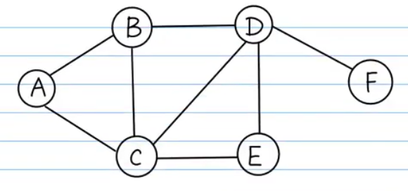

# Graph
Ref: https://www.youtube.com/watch?v=bD8RT0ub--0&list=PLAnjpYDY-l8IacYv_2lIZxNrQmkY3paSN&index=3
## **Introduction**

### **Graph**
<details>
  <summary>Structure</summary>


```python
graph={
    'A':['B','C'],
    'B':['A','C','D'],
    'C':['A','B','D','E'],
    'D':['B','C','E','F'],
    'E':['C','D'],
    'F':['D']
}
```
</details>

### **BFS-Level Order**
<details>
  <summary>Temple</summary>

```python
# visit the node when pop out from the queue.(It also right to visit the node before push in into the queue,)
def BFS(graph, root):
    queue=[]
    seen=set()
    queue.append(root)
    seen.add(root)
    while(len(queue)>0):
        vertex=queue.pop(0)
        print(vertex)
        for n in graph[vertex]:
            if n not in seen:
                queue.append(n)
                seen.add(n)
```
```python
BFS(graph,'A') # result is ABCDEF
```
</details>

### **DFS-Interative**
<details>
  <summary>Temple</summary>

```python
# visit the node when pop out from the stack
def DFS(graph, root):
    stack=[]
    seen=set()
    stack.append(root)
    seen.add(root)
    while(len(stack)>0):
        vertex=stack.pop()
        print(vertex)
        for n in graph[vertex]:
            if n not in seen:
                stack.append(n)
                seen.add(n)
```
</details>

### **DFS-Recursion**
<details>
  <summary>Temple</summary>

```python
def DFS(graph, root, seen):
    print(root)
    seen.add(root)
    for w in graph[root]:
        if w not in seen:
            DFS(graph, w, seen)
```
</details>

## **Problems**

#### is-graph-bipartite
[Leetcode No785](https://leetcode.com/problems/is-graph-bipartite/)
<details>
  <summary>Solution</summary>

BFS
```python
class Solution:
    def isBipartite(self, graph: List[List[int]]) -> bool:
        # 0-not visited, 1-red, 2-green
        visited = [0] * len(graph)
        for i in range(len(graph)):
            if graph[i] and visited[i] == 0:
                visited[i] = 1
                queue =[]
                queue.append(i)
                while len(queue)>0:
                    v = queue.pop(0)
                    for e in graph[v]:
                        if visited[e] != 0:
                            if visited[e] == visited[v]:
                                return False
                        else:
                            visited[e] = 3 - visited[v] #color different with v
                            queue.append(e)
        return True
```
DFS
```python
class Solution:
    def isBipartite(self, graph: List[List[int]]) -> bool:
        colors=[-1]*len(graph)
        for i in range(len(graph)): 
            if colors[i] == -1:
                if not self.ColorGraph(i, 0, colors, graph):
                    return False
                
        return True
    
    def ColorGraph(curNode, curColor, colors, graph):
        if colors[curNode] != -1:
            return colors[curNode] == curColor
        
        colors[curNode] = curColor
        for nextNode in graph[curNode]:
            if not self.ColorGraph(nextNode, 1-curColor, colors, graph):
                return False
        return True
```
</details>

#### is-graph-bipartite
[Leetcode No785](https://leetcode.com/problems/is-graph-bipartite/)
<details>
  <summary>Solution</summary>

```python
```
</details>

#### is-graph-bipartite
[Leetcode No785](https://leetcode.com/problems/is-graph-bipartite/)
<details>
  <summary>Solution</summary>
  
```python
```
</details>

#### is-graph-bipartite
[Leetcode No785](https://leetcode.com/problems/is-graph-bipartite/)
<details>
  <summary>Solution</summary>
  
```python
```
</details>


