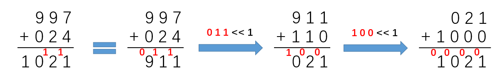

# Bit Manipulation

## **Introduction**
<details>
  <summary>&|^</summary>

- x & 0s = 0   
x & 1s = x     
x & x = x  
for set some digits to 0  
- x | 0s = x   
x | 1s = 1s    
x | x = x  
for set some digits to 1  
- x ^ 0s = x   
x ^ 1s = ~x    
x ^ x = 0  
reverse some digits  
swap two numbers      
- exchange two numbers  
a = a ^ b  
b = a ^ b  
a = a ^ b      
- n&(-n) get the first digit of 1 from right  
10110100 & 01001100 = 00000100      
- n&(n-1) get rid of the first digit of 1 from right  
01011011 & 01011010 =  01011010   

Ref: https://www.jianshu.com/p/cfb7df8d3a8b
</details>

## **Peoblems**

#### hamming-distance 
[Leetcode No461](https://leetcode.com/problems/hamming-distance/)
<details>
  <summary>Solution</summary>

```python
class Solution:
    def hammingDistance(self, x: int, y: int) -> int:
        return Counter(bin(x^y)[2:])['1']
```
```python
class Solution:
    def hammingDistance(self, x: int, y: int) -> int:
        return bin(x ^ y).count('1')
```
</details>

#### single-number 
[Leetcode No136](https://leetcode.com/problems/single-number/)
<details>
  <summary>Solution</summary>

```python
class Solution:
    def singleNumber(self, nums: List[int]) -> int:
        result=0
        for n in nums:
            result=result^n
        return result
```
</details>

#### missing-number 
[Leetcode No268](https://leetcode.com/problems/missing-number/)
<details>
  <summary>Solution</summary>

```python
class Solution:
    def missingNumber(self, nums: List[int]) -> int:
        result=0
        for i in range(len(nums)):
            result=result^nums[i]^i
        return result^len(nums)
```
</details>

#### single-number-iii 
[Leetcode No260](https://leetcode.com/problems/single-number-iii/)
<details>
  <summary>Solution</summary>

```python
class Solution:
    def singleNumber(self, nums: List[int]) -> List[int]:
        diff = 0
        #diff is the XOR of the two numbers 
        for n in nums:
            diff ^= n
            
        # find the first digit from right which is different, other digits is 0
        diff = diff&(-diff) 
    
        result=[0,0]
        for n in nums:
            #divide to groups by the digit we get
            if n & diff == 0:
                result[0] ^= n
            else:
                result[1] ^= n
        
        return result
```
</details>

#### reverse-bits 
[Leetcode No190](https://leetcode.com/problems/reverse-bits/)
<details>
  <summary>Solution</summary>

```python
# add 0 in front to become a number with 32 digits
class Solution:
    def reverseBits(self, n: int) -> int:
        b='0'*(32-len(bin(n)[2:]))+bin(n)[2:]
        return int(b[::-1],2)
```
```python
'''
Base 10:
res = res*10 + n%10
n=n//10
Base 2:
res = res*2 + n%2
n=n//2

or
res = (res<<1)|(n&1)
n>>=1
'''
class Solution:
    def reverseBits(self, n: int) -> int:
        res = 0
        # range(32) means handle leading zero
        # eg. 000110=>01100 not 011
        for i in range(32):
            res = (res << 1) + (n & 1)
            n >>= 1
        return res
```
</details>

#### power-of-two 
[Leetcode No231](https://leetcode.com/problems/power-of-two/)
<details>
  <summary>Solution</summary>

```python
class Solution:
    def isPowerOfTwo(self, n: int) -> bool:
        if bin(n)[2:].count('1')==1 and n>0:
            return True
        else:
            return False
```
```python
# get rid of the 1 from right and see if all the digits are zero or not
class Solution:
    def isPowerOfTwo(self, n: int) -> bool:
        return n>0 and n & (n - 1) == 0
```
</details>

#### power-of-four 
[Leetcode No342](https://leetcode.com/problems/power-of-four/)
<details>
  <summary>Solution</summary>

```python
class Solution:
    def isPowerOfFour(self, num: int) -> bool:
        # if there is only one digit of 1 and if it is odd postion
        return num > 0 and (num & (num - 1)) == 0 and (num & 0b01010101010101010101010101010101) != 0
```
```python
class Solution:
    def isPowerOfFour(self, num: int) -> bool:
        if num <= 0: 
            return False
        # if this number could divided by 4 then continue
        while num%4==0:
            num//=4
        return num==1
```
</details>

#### binary-number-with-alternating-bits 
[Leetcode No693](https://leetcode.com/problems/binary-number-with-alternating-bits/)
<details>
  <summary>Solution</summary>

```python
# see result is all 1s.
class Solution:
    def hasAlternatingBits(self, n: int) -> bool:
        result=n^n>>1
        return (result+1)&result==0
```
</details>

#### number-complement 
[Leetcode No476](https://leetcode.com/problems/number-complement/)
<details>
  <summary>Solution</summary>

```python
# ~0=-1
class Solution:
    def findComplement(self, num: int) -> int:
        s=bin(num)[2:]
        result=''
        for i in s:
            if i=='1':
                result=result+'0'
            else:
                result=result+'1'
        return int(result,2)
```


```python
# we want a mask to get the digits that we need
class Solution:
    def findComplement(self, num: int) -> int:
        # intial mask full of 1
        mask=~0
        while num&mask!=0:
            mask=mask<<1
        return ~num ^ mask
```
</details>

#### sum-of-two-integers 
[Leetcode No371](https://leetcode.com/problems/sum-of-two-integers/)
<details>
  <summary>Solution</summary>


```python
# deal with negative number
class Solution:
    def getSum(self, a: int, b: int) -> int:
        # 32 bits integer max
        MAX = 0x7FFFFFFF
        # mask to get last 32 bits
        mask = 0xFFFFFFFF
        while b!=0:
            # add (first time add two numbers, then add the carry)
            # !!!at the same time
            a, b = (a ^ b) & mask, ((a & b) << 1) & mask
        return a if a <= MAX else ~(a ^ mask)
```
</details>

#### maximum-product-of-word-lengths 
[Leetcode No318](https://leetcode.com/problems/maximum-product-of-word-lengths/)
<details>
  <summary>Solution??</summary>

```python
```
</details>

#### counting-bits 
[Leetcode No338](https://leetcode.com/problems/counting-bits/)
<details>
  <summary>Solution</summary>

```python
class Solution:
    def countBits(self, num: int) -> List[int]:
        result=[]
        for i in range(num+1):
            result.append(Counter(bin(i)[2:])['1'])
            
        return result
```
```python
'''
0000    0  0
0001    1  1
0010    1  2
0011    2  3
0100    1  4
0101    2  5
0110    2  6
0111    3  7
1000    1  8
1001    2  9
1010    2  10
1011    3  11
1100    2  12
1101    3  13
1110    3  14
1111    4  15

result[i] = result[i >> 1] + (i & 1)
i & 1 is 1 when odd
i & 1 is 0 when even
'''
class Solution:
    def countBits(self, num: int) -> List[int]:
        res = [0] * (num + 1)
        for i in range(1, num + 1):
            res[i] = res[i // 2] + i % 2
        return res
```
</details>


