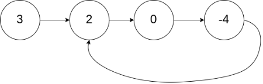
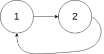

### 141. Linked List Cycle
Given a linked list, determine if it has a cycle in it.

To represent a cycle in the given linked list, we use an integer pos which represents the position (0-indexed) in the linked list where tail connects to. If pos is -1, then there is no cycle in the linked list.

Example 1:

Input: head = [3,2,0,-4], pos = 1
Output: true
Explanation: There is a cycle in the linked list, where tail connects to the second node.

  
Example 2:

Input: head = [1,2], pos = 0
Output: true
Explanation: There is a cycle in the linked list, where tail connects to the first node.



Example 3:

Input: head = [1], pos = -1
Output: false
Explanation: There is no cycle in the linked list.


Follow up:
Can you solve it using O(1) (i.e. constant) memory?
#### Python
```python
# Definition for singly-linked list.
# class ListNode:
#     def __init__(self, x):
#         self.val = x
#         self.next = None

class Solution:
    def hasCycle(self, head: ListNode) -> bool:
        if head == None:
            return False
        l1 = head
        l2 = head.next
        while l1 and l2 and l2.next :
            if l1 == l2: 
                return True
            l1 = l1.next
            l2 = l2.next.next
        return False
```
#### Csharp
```csharp
/**
 * Definition for singly-linked list.
 * public class ListNode {
 *     public int val;
 *     public ListNode next;
 *     public ListNode(int x) {
 *         val = x;
 *         next = null;
 *     }
 * }
 */
public class Solution {
    public bool HasCycle(ListNode head) {
        if (head == null) {
            return false;
        }
        ListNode l1 = head, l2 = head.next;
        while (l1 != null && l2 != null&& l2.next != null) {
            if (l1 == l2) {
                return true;
        }
        l1 = l1.next;
        l2 = l2.next.next;
        }
        return false;
    }
}
```
